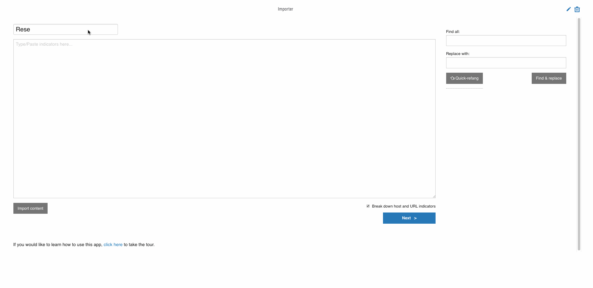

# Indicator Importer

App for quickly and easily getting indicators into the platform and adding metadata around them.



## Installation

To install this app in ThreatConnect, use the following commands:

```
# clone this repo
git clone https://github.com/ThreatConnect-Inc/threatconnect-spaces.git
# move into the directory for this app
cd threatconnect-spaces/spaces/TCS_-_Indicator_Importer
# package the app
make pack
```

After running these commands, there will be a zip file in the `spaces/TCS_-_Indicator_Importer/` directory which you can install in ThreatConnect.

## Setup

### Attributes in Datastore (required)

This app pulls attributes from the datastore. Thus, you will need to write a list of attributes like the one in the `example_datastore_attributes.json` file.

### PDF Reader Playbook (optional)

To be able to read content from a pdf online, you will need to install a playbook with an http link trigger app that makes a request to the given site, reads the contents as a PDF, and returns the text. This playbook will be uploaded to the [ThreatConnect playbooks repository](https://github.com/ThreatConnect-Inc/threatconnect-playbooks) soon. Once you have installed the playbook, you also need to add the link to the playbook's http link trigger into this app's `install.json` as the `pdfReaderPlaybookLink` field.

### URL Reader Playbook (optional)

To be able to read content from a URL, you will need to install a playbook with the [HTML Text Parser](https://github.com/ThreatConnect-Inc/threatconnect-playbooks/tree/master/apps/TCPB_-_HTML_Text_Parser) playbook app. This playbook will be uploaded to the [ThreatConnect playbooks repository](https://github.com/ThreatConnect-Inc/threatconnect-playbooks) soon. Once you have installed the playbook, you also need to add the link to the playbook's http link trigger into this app's `install.json` as the `urlReaderPlaybookLink` field.

### OCR (optional)

This app is able to submit an image from a website to an OCR engine. To do this, open `TCS_-_Indicator_Importer/TCS_-_Indicator_Importer/ui/js/vueAppManager.js` and edit the `importFromImage` function.

## Advanced Usage

### Custom Metrics

Every time this app is run, it posts content to a [custom metric](https://docs.threatconnect.com/en/latest/rest_api/custom_metrics/custom_metrics.html#custom-metrics) endpoint. If you're interested in learning more about this, raise an issue and I can explain it further.

### Indicator Profiles

This app provides a functionality I'm calling "Indicator Profiles". It allows you to form a template made up of attributes and tags that can be applied to indicators in bulk. For example, I may want to have a profile for callback URLs that applies the "C2" tag and an "IP and Host Usage" attribute with a value of "C2". If you have questions, raise and issue and I can add more documentation about how to make these.
