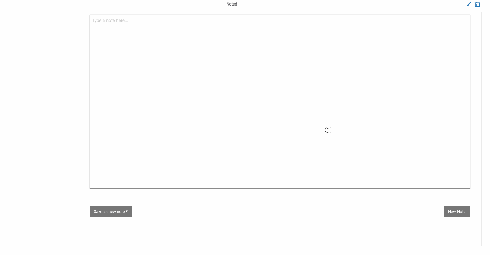

# Note Taking App

ThreatConnect spaces apps for taking notes.



## Getting Started

To get started, the code for the app is in the `src/` folder. To setup your environment for testing, run:

```
make setup
```

## Build App For Release

```
make pack
```

This will package the app as `target/TCS_-_Note_Taker.tcx`.

## Build App in Development Mode (does not minify or uglify code, so it can be debugged in browser)

```
make pack-dev
```

## Deploy

In the ThreatConnect UI install the App (the `.tcx` file) created in the [Build App for Release](#build-app-for-release) section.

## Credits

This package was created with [Cookiecutter](https://github.com/audreyr/cookiecutter) and [Floyd Hightower's Spaces App Template](https://github.com/fhightower-templates/threatconnect-angular-spaces-template).
